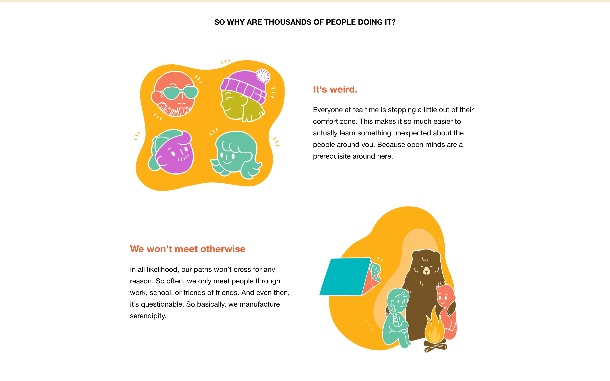
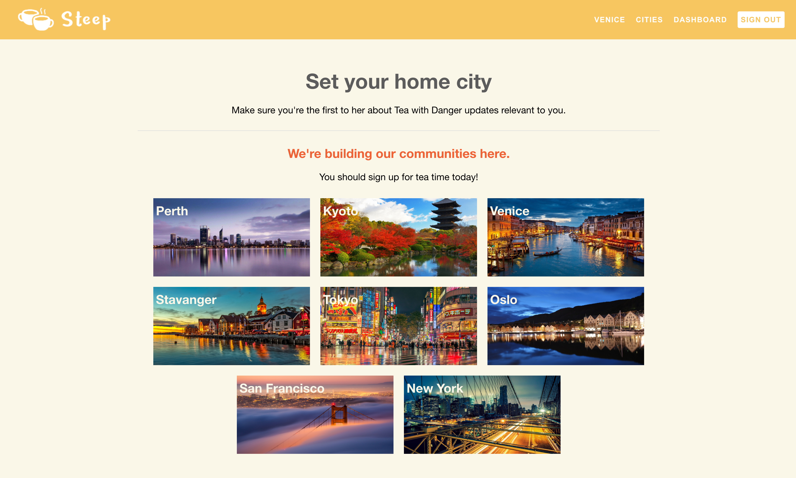

# Steep
[Live](https://www.steepwithstrangers.com/)

Steep is a web application inspired by Tea With Strangers.  Steep allows users to meet for tea/coffee in a number of cities around the world at a time and date that works for them.

## Technologies Used
On the back-end, Steep uses Rails and PostgreSQL to manage and access the data that is necessary for the application to function.  The views rendered by the controller were built using the DSL provided by Jbuilder.  On the front-end, React was used to create an interactive user interface that only reloads elements in the DOM when absolutely necessary. Redux was used with React to allow for cleaner state access.

## Application Features & Implementation

### Home Page
The home page provides information to the user about why they should be using Steep.



### Events

The event detail component displays the information saved as a single entry in the database's events table.  In the database, each event is required to have a `date`, `title`, `address`, `description`, `host_id`, `city_id`, `max_attend`, and `current_attend`. When logged in users can choose to join an event that still has spots available.  An entry in the joins table is created using the id of the current user the id of the targeted event, both of which are accessible because they were explicitly included in the state. The event is subsequently located and updated on the back-end by incrementing the event's `current_attend` and saving the updated event to the database.

In order to clean up the code on the front-end, all of the logic used to select the events that corresponded to a particular city was moved to the back-end.  Instead of iterating through an array of all of the events for every city and filtering by `city_id`, I instead used an association on a particular city to retrieve all of the events hosted there.  Using Jbuilder, I appended this information to the cities :index and :show so that it would be accessible whenever the relevant controller action was called.

```javascript
json.set! @city.id do
  json.id @city.id
  json.name @city.name
  json.image_url @city.image_url
  json.events do
    @city.events.each do |event|
      json.set! event.id do
        json.id event.id
        json.date event.date
        json.time event.time
        json.address event.address
        json.description event.description
        json.host_id event.host_id
        json.city_id event.city_id
        json.max_attend event.max_attend
        json.current_attend event.current_attend
        json.event_full event.current_attend == event.max_attend
        if logged_in?
          json.attending !!current_user.joins.find_by(event_id: event.id)
        end
        if logged_in?
          json.hosting !!current_user.hosts.find_by(event_id: event.id)
        end
        json.event_full event.current_attend == event.max_attend
      end
    end
  end
end
```

In addition to attaching a city's events to the json response from the server, I also include key-value pairs that are conditionally rendered depending on whether or not the user is logged in.  If a user is logged in and there are events currently listed in the events index, the events listed in the city slice will also include boolean values that correspond to whether the current user is attending or hosting the event.

Because I use cities to view events instead of the events themselves, the application state never includes an isolated list of events.  Therefore, in order to trigger an event detail component to re-render, the request to the Events Controller to update an event (when a user joins or leaves) returns a city's show view, providing an updated list of the city's events nested within the response.  The object returned as a response from the server is then dispatched to the Cities Reducer where its values are extracted using lodash.values and returned.  The updated events are then accessible in the cities slice of state.


```javascript
const citiesReducer = (state = nullCity, action) => {
  switch(action.type){
    case RECEIVE_CITIES:
      return _.values(action.cities)
    case RECEIVE_CITY:
      return _.values(action.city)
    default:
      return state;
  }
}
```

### Cities Index
Provides the user with a list of all of the cities that Steep participates.



### Dashboard

The Dashboard allows a logged in user to view all of the events that they are signed up for or are hosting.  Like the joins table on the back-end, the hosts table also includes a `user_id` and an `event_id` that link a user to the event that they created.  Once I realized how much cleaner it is to retrieve and return relevant information on the back-end, I refactored my host and join views on the backend to utilize the association between a particular host or join and event.  I then used Jbuilder to include the event that corresponded to the host or join that was requested from the front-end.  This way I was able to access the event information and place it within an event detail container that gives the user the ability to cancel the event if they are the host, or to leave the event if they are currently attending.


## Future Directions for the Project
### User Profiles and messaging
In the future, I would like to implement user profiles to give the site a more personal touch.  Additionally, I would like to give users the option to message hosts and other users if they have any questions about the event or would like to remain in touch after an event is over.

### Google Map API
I would also like to implement a Google Map API that drops a pin where the event is being hosted.  This way users will know if an event is close enough to attend.
